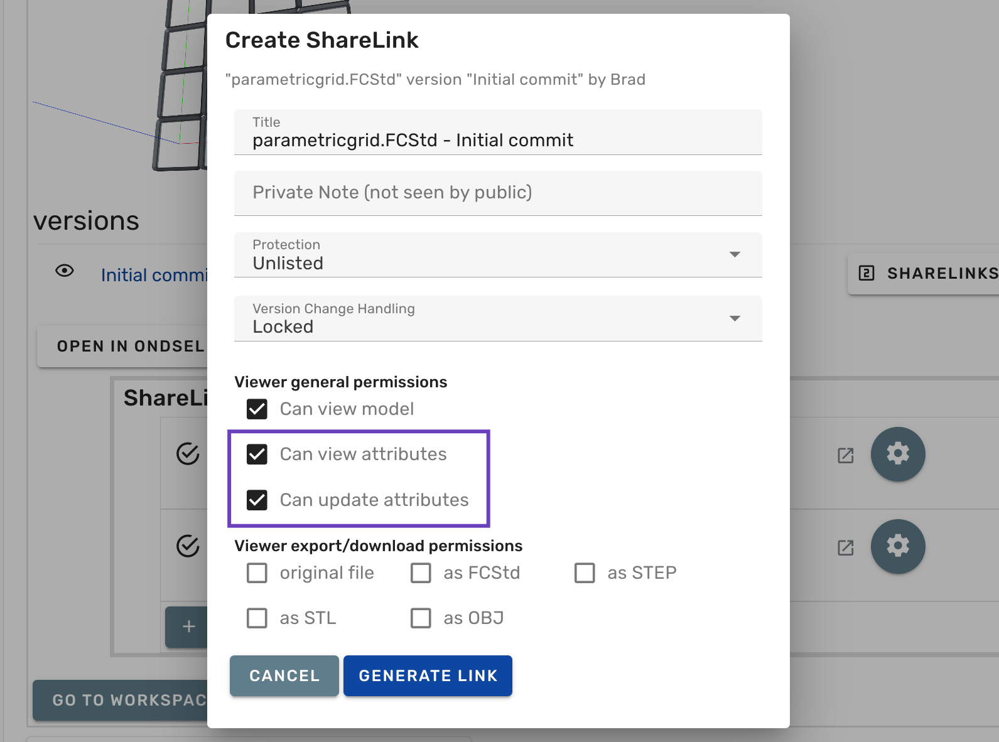

To make a parametric model accessible to other Lens users, do the following:

1. Start creating a new share link

---

2.  Check the following two boxes: _Can view attributes_ and _Can update attributes_.

---

3. Click **Generate Link** to create the share link.

---

When a user opens a parametric model with attributes and starts updating it, Lens creates a copy of the original model in user's currently selected organization and performs all operations on that copy.