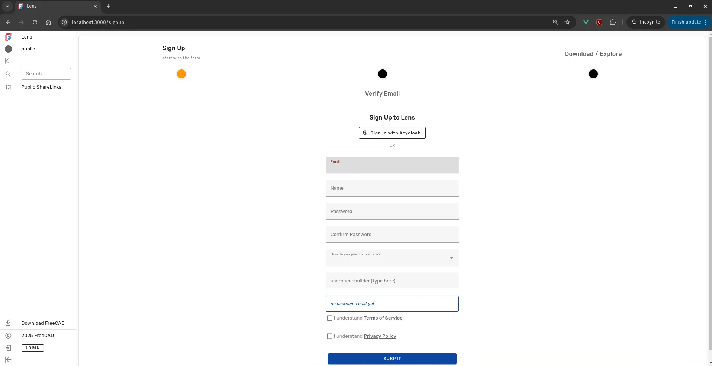
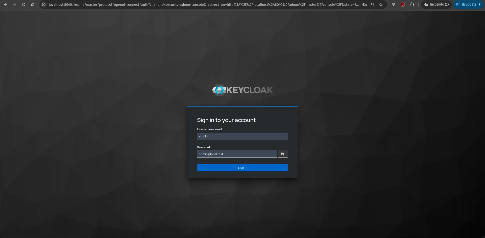

Amritpal Singh has just pushed code that adds support for OpenID Connect (OIDC) authentication. This work was sponsored through the Ondsel Onward fund contributed anonymously and managed by the FreeCAD Project Association.

<!--more-->

Here is a quick rundown of the changes:

- The site configuration now optionally manage OIDC configuration. You can enable and disable support for it in the admin panel (Xavier).
- SSO login flows are supported. You can log in with OIDC identity provider via Feathers OAuth service.
- External OIDC identities are mapped to Lens users, accounts are linked based on email

Here is the updated Sign Up page with Keycloak support enabled:

Here is the Keycloak login page:

