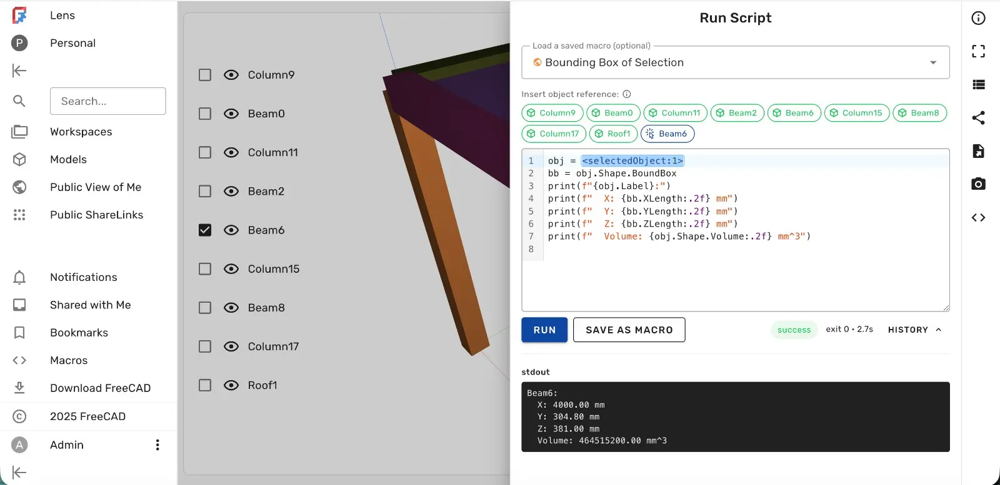

Running custom Python scripts on your models in the web interface for Ondsel Lens was originally planned as an Enterprise-tier feature. A few years later, it's finally implemented and available to everybody.

<!--more-->

Here is what the UI looks like:

You can all store all code snippets on your account for later use. They are available on the newly added Macros page:

From the technical (and security) standpoint, this new feature is about executing Python scripts in FC-Worker inside a restricted bubblewrap sandbox. Implementing it involved patching both the backend, the frontend, and FC-Worker.

All work was done by Amritpal Singh thanks to the Ondsel Onward fund donated anonymously and managed by the FreeCAD Project Association.